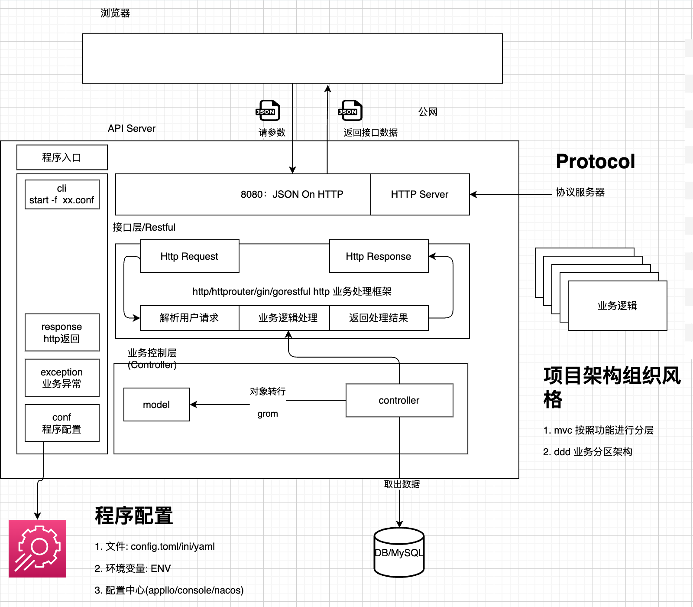
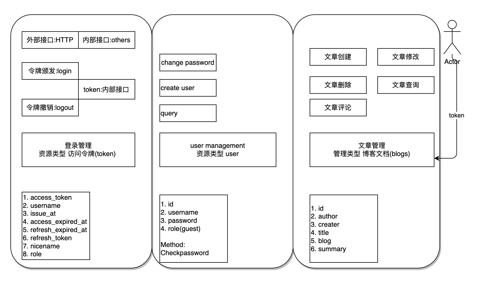

# golang-博客系统

### 项目技术栈于架构




### 功能设计





###  登录接口

```go
type Token struct {
	// 该Token是颁发
	UserId string `json:"user_id" gorm:"column:user_id"`
	// 人的名称， user_name
	UserName string `json:"username" gorm:"column:username"`
	// 办法给用户的访问令牌(用户需要携带Token来访问接口)
	AccessToken string `json:"access_token" gorm:"column:access_token"`
	// 过期时间(2h), 单位是秒
	AccessTokenExpiredAt int `json:"access_token_expired_at" gorm:"column:access_token_expired_at"`
	// 刷新Token
	RefreshToken string `json:"refresh_token" gorm:"column:refresh_token"`
	// 刷新Token过期时间(7d)
	RefreshTokenExpiredAt int `json:"refresh_token_expired_at" gorm:"column:refresh_token_expired_at"`

	// 创建时间
	CreatedAt int64 `json:"created_at" gorm:"column:created_at"`
	// 更新实现
	UpdatedAt int64 `json:"updated_at" gorm:"column:updated_at"`

	// 额外补充信息, gorm忽略处理
	Role user.Role `json:"role" gorm:"-"`
}
```

### 登录接口
请求: 令牌颁发请求
```json

```

响应: Token对应

```json
{"user_id":"admin","username":"","access_token":"","access_token_expired_at":0,"refresh_token":"","refresh_token_expired_at":0,"created_at":0,"updated_at":0,"role":1}
```

- Logout: DELETE /vblog/api/v1/tokens HEADER cookei
```http
Custom-Header: access_token
```

### 博客管理接口

定义blog对象
- Meta数据: 每一个对象必须要有的熟悉

```go
type Meta struct {}
```


- 用户参数
```go
type CreateBlogRequest struct {}
```


- 整个对象:

```go
type Blog struct {
	// 用户Id
	Id int `json:"id" gorm:"column:id"`
	// 创建时间, 时间戳 10位, 秒
	CreatedAt int64 `json:"created_at" gorm:"column:created_at"`
	// 更新时间, 时间戳 10位, 秒
	UpdatedAt int64 `json:"updated_at" gorm:"column:updated_at"`

	// 用户参数
	*CreateBlogRequest
	// 发布
	*ChangedBlogStatusRequest
	// 审核
	*AuditInfo
}
```

- 博客创建接口 CreateBlog: POST /vblog/api/v1/blogs
```json
{
        	"title": "",
        	"author": "",
        	"content": "",
        	"summary": "",
        	"create_by": "",
        	"tags": {}
        }
```

```json```
- 博客列表接口 blog: GET /vblog/api/v1/blogs

```json
{
        	"id": 0,
        	"created_at": 1717075434,
        	"updated_at": 0,
        	"title": "",
        	"author": "",
        	"content": "",
        	"summary": "",
        	"create_by": "",
        	"tags": {},
        	"published_at": 0,
        	"status": 0
        }
```

```json```
 
- 博客查询接口blog: GET /vblog/api/v1/blogs/{id}

```json

```

- 博客修改接口blog: GET /vblog/api/v1/blogs?page_size=10&

```json

```
- 博客全量修改接口blog: PUT /vblog/api/v1/blogs/{id}

```json
 {
        	"published_at": 0,
        	"status": 0
        }
```
- 博客增量修改接口blog: PATCH /vblog/api/v1/blogs/{id}

```json

```


- 博客增删除接口blog: DELETE /vblog/api/v1/blogs/{id}

```json

```