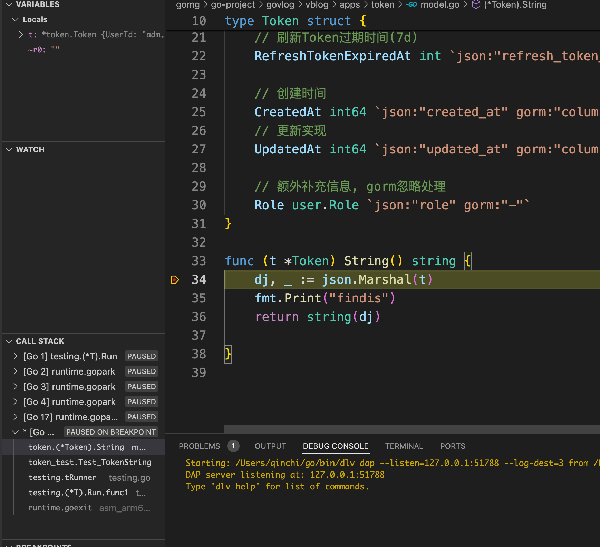

# 关于单元测试

1. 被测试文件: 文件名_test.go
2. 被测试包: 包名_test token ---->token_test
3. 被测试函数: 
    - 测试函数名称: Test被测试函数的名称
    - 测试函数签名: (t *testing.T)

## Test
```sh
=== RUN   Test_TokenString
findis    /Users/qinchi/Documents/go/gomg/go-project/govlog/vblog/apps/token/model_test.go:18: {"user_id":"admin","username":"","access_token":"","access_token_expired_at":0,"refresh_token":"","refresh_token_expired_at":0,"created_at":0,"updated_at":0,"role":1}
--- PASS: Test_TokenString (0.00s)
PASS
ok  	github.com/qinchi-ops/govlog/vblog/apps/token	0.719s
```

## debug Test


1. 在你需要排查的地方打断点
2. 点击单元测试的Debug Test

```sh
Starting: /Users/qinchi/go/bin/dlv dap --listen=127.0.0.1:51779 --log-dest=3 from /Users/qinchi/Documents/go/gomg/go-project/govlog/vblog/apps/token
DAP server listening at: 127.0.0.1:51779
Type 'dlv help' for list of commands.
findisPASS
Process 43043 has exited with status 0
Detaching
```
